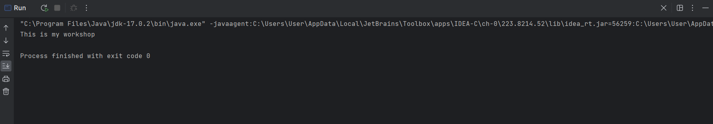

# This is my second workshop

## These are the steps that I followed to finish the workshop

- Create the project
- Connect to Github
- Push the changes
- Submit the workshop

This is the console when i ran my program:

